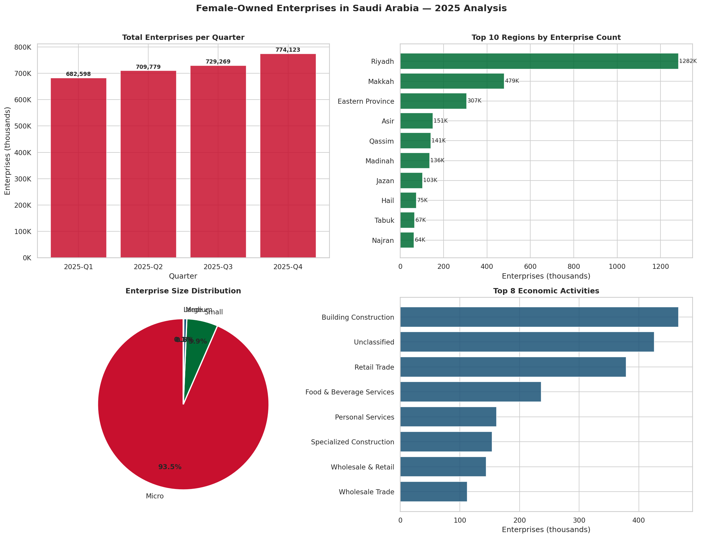

# 🇸🇦 Female-Owned Enterprises in Saudi Arabia — Forecast to 2030

A data science project analyzing the growth of female-owned enterprises across all 13 Saudi regions using 2025 quarterly data, with a machine learning model to forecast trends through 2030.

---

## 📊 Project Overview

| Item | Detail |
|---|---|
| **Dataset** | Female-Owned Enterprises — Q1 to Q4 2025 |
| **Source** | Saudi Open Data Portal |
| **Regions** | 13 Saudi regions |
| **Economic Activities** | 89 sectors |
| **Records (after cleaning)** | 13,069 rows |
| **Model** | Linear Regression |
| **R² Score** | 0.9702 |

---

## 🔮 Key Findings

- **Q4 2025:** 774,123 female-owned enterprises recorded
- **Growth within 2025:** +13.4% from Q1 to Q4
- **Top region:** Riyadh — 1,282,147 enterprises (2025 total)
- **Dominant size:** Micro enterprises (~94% of all enterprises)
- **Forecast 2030:** ~5.2 million enterprises annually

### 📈 Quarterly Growth (2025)

| Quarter | Enterprises | Growth |
|---|---|---|
| Q1 2025 | 682,598 | — |
| Q2 2025 | 709,779 | +4.0% |
| Q3 2025 | 729,269 | +6.8% |
| Q4 2025 | 774,123 | +13.4% |

### 🏆 Top 3 Regions

| Region | Total (2025) |
|---|---|
| Riyadh | 1,282,147 |
| Makkah | 478,927 |
| Eastern Province | 306,941 |

---

## 🗂️ Project Structure

```
female-owned-enterprises-2030/
│
├── data/
│   ├── Female_Owned_Enterprises_First_Quarter_CSV.csv
│   ├── Female_Owned_Enterprises_Second_Quarter_CSV.csv
│   ├── Female_Owned_Enterprises_Third_Quarter_CSV.csv
│   └── Female_Owned_Enterprises_Fourth_Quarter_CSV.csv
│
├── notebooks/
│   └── Female_Owned_Enterprises_2030.ipynb   ← Main Colab notebook
│
├── images/
│   ├── 01_EDA_Analysis.png
│   └── 02_Forecast_2030.png
│
└── README.md
```

---

## 🛠️ Libraries & Methods Used

### Pandas
| Method | Purpose |
|---|---|
| `pd.read_csv()` | Load CSV files into DataFrames |
| `pd.concat()` | Merge all 4 quarterly files into one |
| `df.columns.str.strip()` | Remove whitespace from column names |
| `df.rename(columns={})` | Rename Arabic columns to English |
| `df.isnull().sum()` | Count missing values per column |
| `df.dropna()` | Remove rows with missing values |
| `df.astype()` | Convert column data types |
| `df.groupby().sum()` | Aggregate totals by region / quarter |
| `df.sort_values()` | Sort data for ranking |
| `df.nunique()` | Count distinct values |
| `df.corr()` | Compute correlation matrix |
| `df.describe()` | Summary statistics |
| `df.info()` | Column types and null counts |

### NumPy
| Method | Purpose |
|---|---|
| `np.sqrt()` | Calculate RMSE from MSE |
| `np.arange()` | Generate numeric ranges for plots |

### Matplotlib
| Method | Purpose |
|---|---|
| `plt.subplots()` | Create figure and axes grid |
| `ax.bar()` | Vertical bar chart |
| `ax.barh()` | Horizontal bar chart |
| `ax.pie()` | Pie chart |
| `ax.plot()` | Line chart (trend line) |
| `ax.axvline()` | Vertical reference line |
| `ax.annotate()` | Add arrows and text labels |
| `ax.set_title/xlabel/ylabel()` | Chart labels |
| `mticker.FuncFormatter()` | Custom axis number format |
| `plt.tight_layout()` | Fix spacing between panels |
| `plt.show()` | Render chart |

### Seaborn
| Method | Purpose |
|---|---|
| `sns.set_theme()` | Set global chart style |
| `sns.heatmap()` | Correlation matrix heatmap |

### Scikit-learn
| Method | Purpose |
|---|---|
| `LinearRegression()` | Create regression model |
| `.fit(X, y)` | Train the model |
| `.predict(X)` | Generate predictions |
| `.coef_` | Get the slope |
| `.intercept_` | Get the intercept |
| `r2_score()` | Measure model accuracy (0–1) |
| `mean_squared_error()` | Measure average prediction error |

---

## 🚀 How to Run

### Option 1 — Google Colab (Recommended)
1. Open [colab.research.google.com](https://colab.research.google.com)
2. **File → Upload notebook** → upload `Female_Owned_Enterprises_2030.ipynb`
3. Upload all 4 CSV files via the 📁 sidebar
4. **Runtime → Run all**

### Option 2 — Local
```bash
# Clone the repo
git clone https://github.com/YOUR_USERNAME/female-owned-enterprises-2030.git
cd female-owned-enterprises-2030

# Install dependencies
pip install pandas numpy matplotlib seaborn scikit-learn

# Run notebook
jupyter notebook notebooks/Female_Owned_Enterprises_2030.ipynb
```

---

## 📉 Visualizations

### EDA Analysis


### Forecast to 2030
.png)

---

## 🤖 Model Details

**Algorithm:** Linear Regression  
**Feature:** `time_index = year × 4 + quarter` (converts each quarter into a sequential number)  
**Target:** Total female-owned enterprises per quarter

| Metric | Value |
|---|---|
| R² Score | 0.9702 |
| RMSE | ~5,760 |
| Slope | +29,406 enterprises per quarter |

The model captures a strong linear upward trend, with an R² of 0.97, meaning it explains 97% of the variance in the data.

---

## 📅 2030 Forecast

| Year | Predicted Annual Total |
|---|---|
| 2026 | ~3,366,273 |
| 2027 | ~3,836,777 |
| 2028 | ~4,307,281 |
| 2029 | ~4,777,785 |
| **2030** | **~5,248,289** |

---

## 👤 Author

**Nasser**  
Computer Science Student — King Abdulaziz University  
[GitHub](https://github.com/NasserYQ)

---

## 📄 License

This project is open source under the [MIT License](LICENSE).
